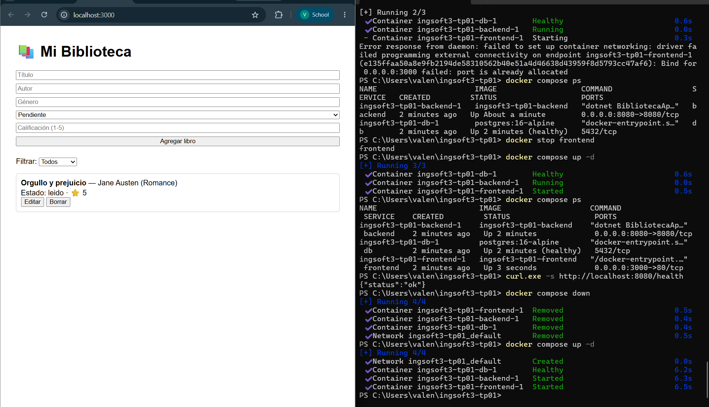
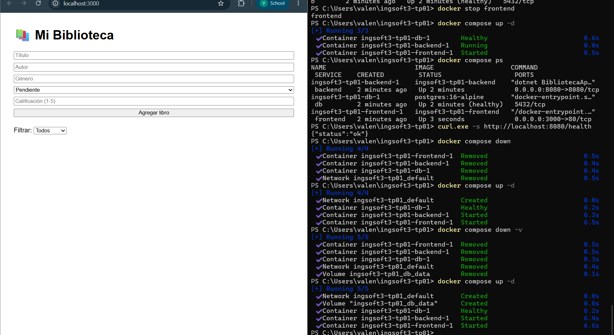
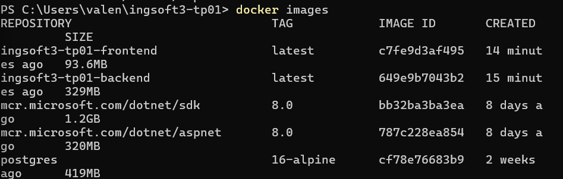
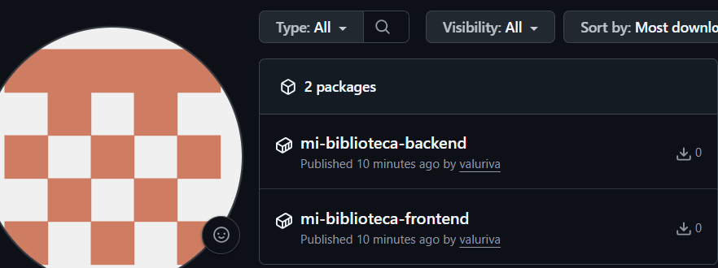

# Evidencias — TP1

## 1. Push directo a main rechazado

GitHub rechaza el push porque `main` está protegida y la regla alcanza también al dueño del repositorio (`GH006: Protected branch update failed`).

## 2. Aviso de conflicto en el PR de la rama B

El PR de `feature/titulo-b` no se puede mergear automáticamente porque modifica la misma línea del README que ya había cambiado la rama A, mergeada previamente.

## 3. Marcadores del conflicto

Los delimitadores `<<<<<<<`, `=======` y `>>>>>>>` marcan las dos versiones en conflicto del título del README, una por cada rama.

## 4. Release v1.0.0 publicada

La release `v1.0.0` quedó publicada sobre el tag creado en `main`, con las notas de qué incluye.

## TP2 — Contenedores

### 1. Sistema funcionando end-to-end

La app corriendo en localhost:3000, con un libro cargado, mostrando que frontend, backend y base de
datos están comunicados correctamente.

### 2. Prueba de persistencia

Después de `docker compose down` + `up`, el libro sigue apareciendo (el volumen sobrevive). Con
`down -v`, la lista queda vacía (el volumen se borró).

### 3. Comparación de tamaños de imagen

`docker images` mostrando `dotnet/sdk:8.0` (1.2GB) vs `dotnet/aspnet:8.0` (320MB) vs la imagen final
del backend (329MB) — el multi-stage build reduce el peso final casi 4 veces respecto al SDK.

### 4. Imágenes publicadas en el registry

Las imágenes `mi-biblioteca-backend` y `mi-biblioteca-frontend` publicadas en ghcr.io con
visibilidad pública.
