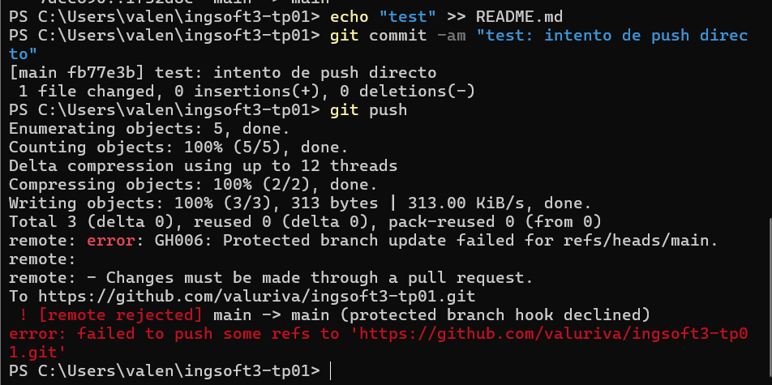
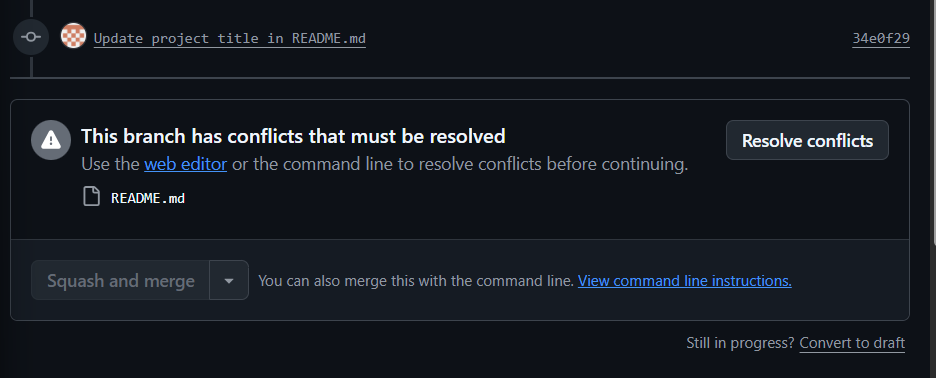
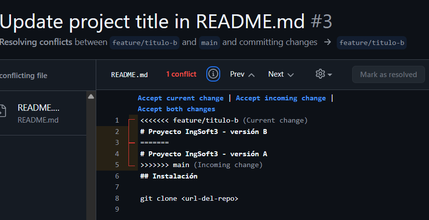
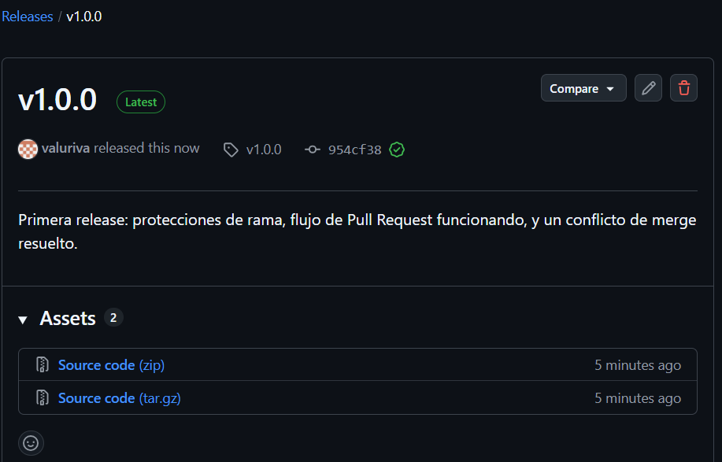

# Evidencias — TP1

## 1. Push directo a main rechazado

GitHub rechaza el push porque `main` está protegida y la regla alcanza también al dueño del repositorio (`GH006: Protected branch update failed`).

## 2. Aviso de conflicto en el PR de la rama B

El PR de `feature/titulo-b` no se puede mergear automáticamente porque modifica la misma línea del README que ya había cambiado la rama A, mergeada previamente.

## 3. Marcadores del conflicto

Los delimitadores `<<<<<<<`, `=======` y `>>>>>>>` marcan las dos versiones en conflicto del título del README, una por cada rama.

## 4. Release v1.0.0 publicada

La release `v1.0.0` quedó publicada sobre el tag creado en `main`, con las notas de qué incluye.
